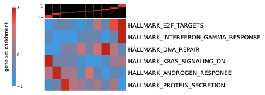

# pyPAGE

`pyPAGE` is a Python implementation of the conditional-information PAGE framework for gene-set enrichment analysis.

It is designed to infer differential activity of pathways and regulons while accounting for annotation and membership biases using information-theoretic methods.

## Approach

### Bulk PAGE

Standard gene-set enrichment methods test whether pathway members are non-randomly distributed across a ranked gene list. pyPAGE frames this as an information-theoretic question: **how much does knowing a gene's pathway membership tell you about its expression bin?**

1. **Discretize** continuous expression scores (e.g. log2 fold-change) into equal-frequency bins
2. **Compute mutual information (MI)** between expression bins and pathway membership — or **conditional MI (CMI)**, which conditions on how many pathways each gene belongs to, correcting for the bias that heavily-annotated genes drive spurious enrichment
3. **Permutation test** to assess significance, with early stopping
4. **Redundancy filtering** removes pathways whose signal is explained by an already-accepted pathway (via CMI between memberships)
5. **Hypergeometric enrichment** per bin produces the iPAGE-style heatmap showing *which* expression bins drive each pathway's signal

### Single-Cell PAGE

For single-cell data, the question becomes: **are pathway scores spatially coherent across the cell manifold?** A pathway whose activity varies smoothly across cell states (rather than randomly) is biologically meaningful.

1. **Per-cell scoring** — for each cell, compute MI or CMI between gene expression bins and pathway membership across all genes. This produces an (n_cells x n_pathways) score matrix
2. **KNN graph** — build a cell-cell k-nearest-neighbor graph from expression (or use a precomputed one from scanpy)
3. **Geary's C** — measure spatial autocorrelation of each pathway's scores on the KNN graph. Report C' = 1 - C, where higher values mean the pathway varies coherently across the manifold rather than randomly
4. **Permutation test** — generate size-matched random gene sets, compute their C', and derive empirical p-values with BH FDR correction

## Installation

Install from PyPI:

```bash
pip install bio-pypage
```

Or install from source:

```bash
git clone https://github.com/goodarzilab/pyPAGE
cd pyPAGE
pip install -e .
```

## Quick Start

```python
import pandas as pd
from pypage import PAGE, ExpressionProfile, GeneSets

# 1) Load expression profile (gene, score)
expr = pd.read_csv(
    "example_data/AP2S1.tab.gz",
    sep="\t",
    header=None,
    names=["gene", "score"],
)
exp = ExpressionProfile(expr["gene"], expr["score"], is_bin=True)

# 2) Load annotation (gene, pathway)
ann = pd.read_csv(
    "example_data/GO_BP_2021_index.txt.gz",
    sep="\t",
    header=None,
    names=["gene", "pathway"],
)
gs = GeneSets(ann["gene"], ann["pathway"])

# 3) Run pyPAGE
p = PAGE(exp, gs, n_shuffle=100, k=7, filter_redundant=True)
results, heatmap = p.run()

print(results.head())
heatmap.show()
```

`results` contains:
- `pathway`
- `CMI` — conditional mutual information score
- `z-score` — z-score of observed CMI vs. permutation null distribution
- `p-value` — empirical p-value from permutation test
- `Regulation pattern` (`1` for up, `-1` for down)

## Tutorial: DESeq2 Log Fold-Change with Hallmark Gene Sets

This example runs pyPAGE on DESeq2 differential expression results (log2 fold-change) against MSigDB Hallmark gene sets. The input file and GMT are included in `example_data/`.

**Step 1 — Run pyPAGE:**

```bash
pypage -e example_data/test_DESeq_logFC.txt.gz \
    --gmt example_data/h.all.v2026.1.Hs.symbols.gmt \
    --type continuous --cols GENE,log2FoldChange --seed 42
```

This creates `example_data/test_DESeq_logFC_PAGE/` with results, heatmap, and enrichment matrix.

**Step 2 — Re-plot with custom color scale:**

```bash
pypage --draw-only -e example_data/test_DESeq_logFC.txt.gz \
    --type continuous \
    --min-val -2 --max-val 3 --bar-min -1 --bar-max 1
```

`--draw-only` re-renders the heatmap from the saved matrix without re-running the analysis. `--min-val`/`--max-val` control the enrichment color scale; `--bar-min`/`--bar-max` normalize the bin-edge indicator bar.

**Example output:**



## Loading Gene Sets

Gene sets can be loaded from multiple sources:

**Paired arrays** — gene and pathway name arrays of equal length:
```python
gs = GeneSets(genes=gene_array, pathways=pathway_array)
```

**Annotation index files** — tab-delimited files where each line starts with a pathway name followed by its member genes (supports gzip):
```python
gs = GeneSets(ann_file="GO_BP_2021_index.txt.gz")
# If the first column is genes (not pathways):
gs = GeneSets(ann_file="annotations.txt", first_col_is_genes=True)
```

**GMT files** — MSigDB `.gmt` format (plain or gzipped), with optional size filtering:
```python
gs = GeneSets.from_gmt("h.all.v2024.1.Hs.symbols.gmt")
gs = GeneSets.from_gmt("c2.cp.kegg.gmt", min_size=15, max_size=500)

# Export back to GMT
gs.to_gmt("filtered_pathways.gmt")
```

## Loading Expression Data

Expression input can be:
- **Continuous differential scores** (`is_bin=False`, default) — auto-discretized into `n_bins` equal-frequency bins
- **Pre-binned integer labels** (`is_bin=True`) — used as-is

```python
# Continuous scores
exp = ExpressionProfile(genes, scores, n_bins=10)

# Pre-binned labels
exp = ExpressionProfile(genes, bin_labels, is_bin=True)
```

## Gene ID Conversion

### GeneMapper (Recommended)

`GeneMapper` downloads a gene ID mapping table from Ensembl once and caches it locally (~5 MB at `~/.pypage/`) for fast offline lookups. Supported ID types: `'ensg'`, `'symbol'`, `'entrez'`.

```python
from pypage import GeneMapper, GeneSets

# First call downloads from Ensembl; subsequent calls use cache
mapper = GeneMapper(species='human')

# Convert gene IDs
symbols, unmapped = mapper.convert(
    ['ENSG00000141510', 'ENSG00000012048'],
    from_type='ensg', to_type='symbol',
)
# symbols -> ['TP53', 'BRCA1']

# Convert genes in-place on a GeneSets object
gs = GeneSets.from_gmt("kegg_entrez.gmt")
gs.map_genes(mapper, from_type='entrez', to_type='symbol')
```

### Legacy: convert_from_to() (Requires Network)

`ExpressionProfile.convert_from_to()`, `GeneSets.convert_from_to()`, and `Heatmap.convert_from_to()` use Ensembl BioMart (`pybiomart`) and require an active internet connection:

```python
exp.convert_from_to("refseq", "ensg", "human")
```

## Command Line

After installation, `pypage` is available as a command-line tool. All outputs are saved to an auto-created output directory (default: `{expression_stem}_PAGE/`).
`--type` should always be set explicitly: use `--type discrete` for pre-binned inputs and `--type continuous` for score inputs that must be quantized (`--is-bin` remains as a legacy alias for discrete mode).

```bash
# Basic usage — outputs go to expression_PAGE/ directory
pypage -e expression.tab.gz --genesets-long annotations.txt.gz --type discrete

# With GMT file
pypage -e scores.tab --gmt pathways.gmt --type continuous --n-bins 10

# Explicit output directory
pypage -e expr.tab.gz --gmt pathways.gmt --type continuous --outdir my_results/

# Manual pathway mode (bypass significance testing)
pypage -e expr.tab.gz --genesets-long ann.txt.gz --type discrete \
    --manual "apoptotic process,cell cycle"

# With index-format gene sets
pypage -e expr.tab.gz -g index_annotations.txt.gz --type discrete

# Reproducible run with seed
pypage -e expr.tab.gz --gmt pathways.gmt --type continuous --seed 42
```

### Output Files

The output directory contains:
- `results.tsv` — pathway results with CMI, z-score, p-value (scientific notation), and regulation pattern
- `results.matrix.tsv` — enrichment score matrix (for re-plotting)
- `results.killed.tsv` — redundancy filtering log
- `heatmap.pdf` — iPAGE-style enrichment heatmap (editable fonts for Illustrator)
- `heatmap.html` — interactive HTML heatmap

### Visualization Options

```bash
# Custom color scale (asymmetric min/max)
pypage -e expr.tab --gmt pathways.gmt --type continuous --min-val -2 --max-val 5

# Custom bin-edge bar normalization
pypage -e expr.tab --gmt pathways.gmt --type continuous --bar-min -1 --bar-max 1

# Different colormap
pypage -e expr.tab --gmt pathways.gmt --type continuous --cmap RdBu_r

# Re-plot from saved matrix (no re-analysis)
pypage --draw-only -e expr.tab --type continuous --min-val -2 --max-val 3 --bar-min -1 --bar-max 1
```

Run `pypage --help` for a full list of options.

## Single-Cell Command Line

After installation, `pypage-sc` is available for single-cell PAGE analysis. It computes per-cell pathway scores using MI/CMI, tests spatial coherence on the cell-cell KNN graph via Geary's C, and produces an interactive VISION-like HTML report.

### Basic Usage

```bash
# With AnnData h5ad file
pypage-sc --adata data.h5ad --gmt pathways.gmt

# With expression matrix + gene names
pypage-sc --expression matrix.tsv --genes genes.txt --genesets-long ann.txt.gz

# If adata.var_names are Ensembl IDs and gene symbols are in a column
pypage-sc --adata data.h5ad --gene-column gene --gmt pathways.gmt

# Manual mode (bypass permutation testing)
pypage-sc --adata data.h5ad --gmt pathways.gmt \
    --manual "HALLMARK_INTERFERON_ALPHA_RESPONSE,HALLMARK_G2M_CHECKPOINT"
```

### Example: Colorectal Cancer (CRC) Atlas

This example uses a CRC scRNA-seq dataset from [CZ CELLxGENE](https://datasets.cellxgene.cziscience.com/d6742179-6c5f-4ddc-8327-b6719b157abd.h5ad) (13,843 cells) with Hallmark gene sets. Since the AnnData uses Ensembl IDs as `var_names`, the `--gene-column` flag maps to gene symbols stored in `adata.var['gene']`.

```bash
pypage-sc --adata CRC.h5ad --gene-column gene \
    --gmt h.all.v2026.1.Hs.symbols.gmt --seed 42 --n-jobs 4
```

Use `--bin-axis cell` (default) for VISION-like per-cell discretization across genes.
`--bin-axis gene` is available for per-gene discretization across cells.

This creates the output directory `CRC_scPAGE/` with:

```
CRC_scPAGE/
  results.tsv          # pathway results (consistency, p-value, FDR)
  ranking.pdf          # consistency ranking bar chart
  ranking.html         # interactive ranking bars
  report.html          # VISION-like interactive report
  adata.h5ad           # AnnData with scPAGE_ scores in .obs
  umap_plots/          # per-pathway UMAP PDFs (top 10)
    HALLMARK_INTERFERON_ALPHA_RESPONSE.pdf
    ...
```

The top pathway is **HALLMARK_INTERFERON_ALPHA_RESPONSE** (consistency C' = 0.52, FDR = 0.005), showing strong spatial coherence of interferon signaling across the cell manifold.

**`report.html`** is a fully self-contained interactive report (no external dependencies). Open it in any browser to:
- Browse all pathways in a searchable sidebar, sorted by consistency
- Click a pathway to color the UMAP by per-cell scores
- Switch between available embeddings (UMAP, t-SNE, PCA)

**`adata.h5ad`** contains all pathway scores as `scPAGE_*` columns in `adata.obs`, ready for downstream analysis with scanpy:

```python
import scanpy as sc
adata = sc.read_h5ad("CRC_scPAGE/adata.h5ad")
sc.pl.umap(adata, color="scPAGE_HALLMARK_INTERFERON_ALPHA_RESPONSE")
```

### Output Control

```bash
# Disable interactive report
pypage-sc --adata data.h5ad --gmt pathways.gmt --no-report

# Disable saving annotated AnnData
pypage-sc --adata data.h5ad --gmt pathways.gmt --no-save-adata

# Change number of UMAP PDF plots
pypage-sc --adata data.h5ad --gmt pathways.gmt --umap-top-n 20

# Specify embedding for UMAP plots
pypage-sc --adata data.h5ad --gmt pathways.gmt --embedding-key X_tsne

# Save per-cell scores matrix as TSV
pypage-sc --adata data.h5ad --gmt pathways.gmt --scores scores.tsv
```

Run `pypage-sc --help` for a full list of options.

## Bulk PAGE Analysis

The `PAGE` class performs pathway enrichment analysis with permutation testing and optional redundancy filtering:

```python
p = PAGE(exp, gs,
    function='cmi',           # 'cmi' (default, corrects annotation bias) or 'mi'
    n_shuffle=10000,          # permutation count
    alpha=0.005,              # p-value threshold
    k=20,                     # early-stopping parameter
    filter_redundant=True,    # remove redundant pathways (default)
    redundancy_ratio=5.0,     # CMI/MI ratio threshold
    n_jobs=1,                 # parallel threads
)
results, heatmap = p.run()

# Enriched genes per pathway
enriched = p.get_enriched_genes("pathway_name")

# Enrichment score matrix (log10 hypergeometric p-values)
es_matrix = p.get_es_matrix()
```

## Advanced Features

### Manual Pathway Analysis

Analyze specific pathways without significance testing using `run_manual()`:

```python
p = PAGE(exp, gs)
results, heatmap = p.run_manual(["apoptotic process", "cell cycle"])
```

This bypasses permutation testing and redundancy filtering, computing enrichment statistics and a heatmap for only the specified pathways. Useful for inspecting known pathways of interest.

### Inspecting Redundancy Filtering

After a standard `run()` with `filter_redundant=True`, inspect which pathways were removed and why:

```python
p = PAGE(exp, gs)
results, heatmap = p.run()

# DataFrame with columns: rejected_pathway, killed_by, min_ratio
killed = p.get_redundancy_log()
print(killed)
```

### Full Results with Redundancy Flags

`full_results` contains all informative pathways (before redundancy filtering) with a `redundant` column:

```python
p = PAGE(exp, gs)
results, heatmap = p.run()

# All informative pathways, with redundant=True/False
print(p.full_results)
```

## Single-Cell Analysis

`SingleCellPAGE` brings per-cell pathway scoring and spatial coherence testing to pyPAGE, inspired by [VISION](https://github.com/YosefLab/VISION). It accepts AnnData objects or raw numpy arrays.

```python
import anndata
from pypage import GeneSets, SingleCellPAGE

adata = anndata.read_h5ad("my_data.h5ad")
gs = GeneSets(ann_file="annotations.txt.gz")

sc = SingleCellPAGE(
    adata=adata,
    genesets=gs,
    function='cmi',
    bin_axis='cell',  # VISION-like default
    n_jobs=4,
)
results = sc.run(n_permutations=1000)

print(results.head())
```

`results` contains:
- `pathway`
- `consistency` — spatial autocorrelation score (C' = 1 - Geary's C; higher = more coherent)
- `p-value` — empirical p-value from size-matched random gene sets
- `FDR` — Benjamini-Hochberg corrected p-value

### Visualization

```python
sc.plot_pathway_on_embedding("MyPathway", embedding_key='X_umap')
sc.plot_consistency_ranking(top_n=20)
sc.plot_pathway_heatmap(adata.obs['leiden'])
```

### Neighborhood Mode

Aggregate cells by cluster labels and run standard bulk PAGE per group:

```python
summary, group_results = sc.run_neighborhoods(labels=adata.obs['leiden'])
```

### Input Options

| Input | How |
|-------|-----|
| AnnData | `SingleCellPAGE(adata=adata, genesets=gs)` |
| Numpy arrays | `SingleCellPAGE(expression=X, genes=gene_names, genesets=gs)` |
| Precomputed KNN | `SingleCellPAGE(adata=adata, genesets=gs, connectivity=W)` |

## Parameter Reference

### PAGE

| Parameter | Default | Description |
|-----------|---------|-------------|
| `function` | `'cmi'` | `'cmi'` (conditional MI, corrects annotation bias) or `'mi'` |
| `n_shuffle` | `10000` | Number of permutations for significance testing |
| `alpha` | `0.005` | P-value threshold for informative pathways |
| `k` | `20` | Early-stopping: stop after k consecutive non-significant pathways |
| `filter_redundant` | `True` | Remove redundant pathways via CMI |
| `redundancy_ratio` | `5.0` | CMI/MI ratio threshold; pathways with all ratios above this are kept |
| `n_jobs` | `1` | Number of parallel threads |

### SingleCellPAGE

| Parameter | Default | Description |
|-----------|---------|-------------|
| `function` | `'cmi'` | `'cmi'` or `'mi'` |
| `n_bins` | `10` | Number of bins for expression discretization |
| `bin_axis` | `'cell'` | `'cell'` (per-cell across genes, VISION-like) or `'gene'` (per-gene across cells) |
| `n_neighbors` | `ceil(sqrt(n_cells))` | KNN neighbors (capped at 100) |
| `permutation_chunk_size` | auto | Permutations processed per chunk (lower uses less memory) |
| `connectivity` | `None` | Precomputed cell-cell connectivity matrix |
| `n_jobs` | `1` | Number of parallel threads (0 or None for all available) |

### GeneMapper

| Parameter | Default | Description |
|-----------|---------|-------------|
| `species` | `'human'` | `'human'` or `'mouse'` |
| `cache_dir` | `'~/.pypage/'` | Directory for cached mapping file |

## Reproducibility Tips

For deterministic benchmark-style runs:

```python
import numpy as np
np.random.seed(0)
p = PAGE(exp, gs, n_shuffle=100, n_jobs=1)
```

## Tutorials

- **[Comprehensive Tutorial](notebooks/pyPAGE_tutorial.ipynb)** — End-to-end walkthrough covering all features (GMT, GeneMapper, bulk PAGE, single-cell PAGE)
- **[Bulk PAGE Tutorial](notebooks/bulk_page_tutorial.ipynb)** — DESeq2 log fold-change with Hallmark gene sets
- **[Single-Cell PAGE Tutorial](notebooks/sc_page_tutorial.ipynb)** — CRC atlas from CELLxGENE with interactive report
- **[Single-Cell PAGE (Synthetic)](notebooks/single_cell_page_tutorial.ipynb)** — Detailed walkthrough with synthetic data

## Testing

Fast local test profile (default CI profile):

```bash
pytest -q -m "not slow and not online"
```

Full test profile (includes long and network-dependent tests):

```bash
PYPAGE_RUN_ONLINE_TESTS=1 pytest -q
```

## Documentation

For full API details, see `MANUAL.md`.

## Citation

Bakulin A, Teyssier NB, Kampmann M, Khoroshkin M, Goodarzi H (2024)
*pyPAGE: A framework for Addressing biases in gene-set enrichment analysis—A case study on Alzheimer's disease.*
PLoS Computational Biology 20(9): e1012346.
https://doi.org/10.1371/journal.pcbi.1012346

## License

MIT

## About

pyPAGE was developed in the Goodarzi Lab at UCSF by Artemy Bakulin, Noam B. Teyssier, and Hani Goodarzi.
