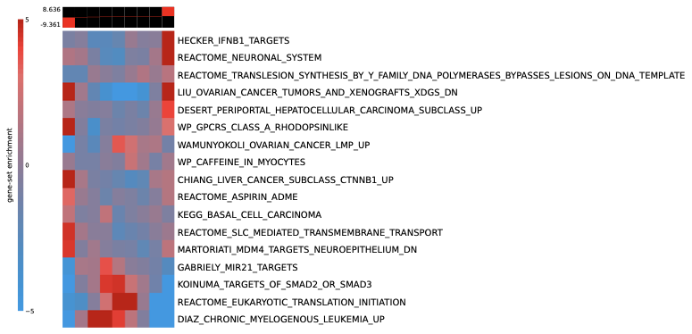
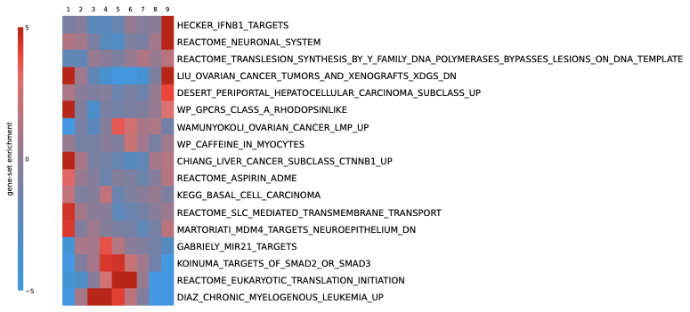
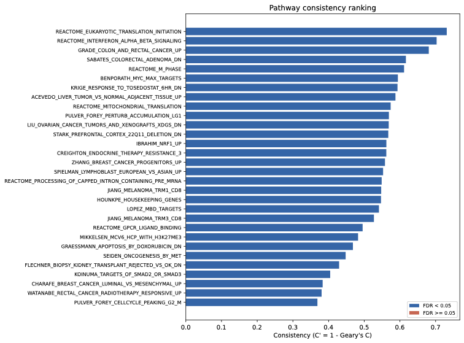
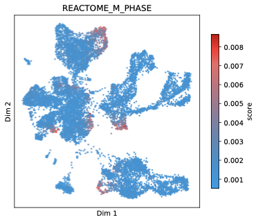
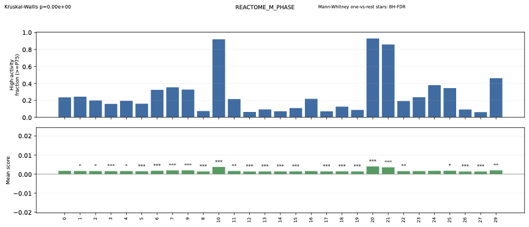

# pyPAGE

[](https://pypi.org/project/bio-pypage/)
[](https://pypi.org/project/bio-pypage/)
[](https://github.com/goodarzilab/pyPAGE/actions/workflows/run_tests.yml)
[](LICENSE)

`pyPAGE` is a Python implementation of the conditional-information PAGE framework for gene-set enrichment analysis.

It is designed to infer differential activity of pathways and regulons while accounting for annotation and membership biases using information-theoretic methods.

## Approach

### Bulk PAGE

Standard gene-set enrichment methods test whether pathway members are non-randomly distributed across a ranked gene list. pyPAGE frames this as an information-theoretic question: **how much does knowing a gene's pathway membership tell you about its expression bin?**

1. **Discretize** continuous expression scores (e.g. log2 fold-change) into equal-frequency bins
2. **Compute mutual information (MI)** between expression bins and pathway membership — or **conditional MI (CMI)**, which conditions on how many pathways each gene belongs to, correcting for the bias that heavily-annotated genes drive spurious enrichment
3. **Permutation test** to assess significance, with early stopping
4. **Redundancy filtering** removes pathways whose signal is explained by an already-accepted pathway (via CMI between memberships)
5. **Hypergeometric enrichment** per bin produces the iPAGE-style heatmap showing *which* expression bins drive each pathway's signal

### Single-Cell PAGE

For single-cell data, the question becomes: **are pathway scores spatially coherent across the cell manifold?** A pathway whose activity varies smoothly across cell states (rather than randomly) is biologically meaningful.

1. **Per-cell scoring** — for each cell, compute MI or CMI between gene expression bins and pathway membership across all genes. This produces an (n_cells x n_pathways) score matrix
2. **KNN graph** — build a cell-cell k-nearest-neighbor graph from expression (or use a precomputed one from scanpy)
3. **Geary's C** — measure spatial autocorrelation of each pathway's scores on the KNN graph. Report C' = 1 - C, where higher values mean the pathway varies coherently across the manifold rather than randomly
4. **Permutation test** — generate size-matched random gene sets, compute their C', and derive empirical p-values with BH FDR correction

## Installation

Install from PyPI:

```bash
pip install bio-pypage
```

Or install from source:

```bash
git clone https://github.com/goodarzilab/pyPAGE
cd pyPAGE
pip install -e .
```

## Quick Start

```python
import pandas as pd
from pypage import PAGE, ExpressionProfile, GeneSets

# 1) Load expression profile (gene, score)
expr = pd.read_csv(
    "example_data/AP2S1.tab.gz",
    sep="\t",
    header=None,
    names=["gene", "score"],
)
exp = ExpressionProfile(expr["gene"], expr["score"], is_bin=True)

# 2) Load annotation (gene, pathway)
ann = pd.read_csv(
    "example_data/GO_BP_2021_index.txt.gz",
    sep="\t",
    header=None,
    names=["gene", "pathway"],
)
gs = GeneSets(ann["gene"], ann["pathway"])

# 3) Run pyPAGE
p = PAGE(exp, gs, n_shuffle=100, k=7, filter_redundant=True)
results, heatmap = p.run()

print(results.head())
heatmap.show()
```

`results` contains:
- `pathway`
- `CMI` — conditional mutual information score
- `z-score` — z-score of observed CMI vs. permutation null distribution
- `p-value` — empirical p-value from permutation test
- `Regulation pattern` (`1` for up, `-1` for down)

## Examples

Use these canonical examples with the bundled `example_data/` outputs.

```bash
pypage -e example_data/test_DESeq_logFC.txt \
    --gmt example_data/c2.all.v2026.1.Hs.symbols.gmt \
    --type continuous --n-bins 9 \
    --cols GENE,log2FoldChange \
    --seed 42 \
    --outdir example_data/test_DESeq_logFC_cont_PAGE
```

```bash
pypage -e example_data/test_DESeq_logFC.txt \
    --gmt example_data/c2.all.v2026.1.Hs.symbols.gmt \
    --type discrete \
    --cols GENE,log2FoldChange_bin9 \
    --seed 42 \
    --outdir example_data/test_DESeq_logFC_disc_PAGE
```

```bash
pypage-sc --adata example_data/CRC.h5ad \
    --gene-column gene \
    --gmt example_data/c2.all.v2026.1.Hs.symbols.gmt \
    --groupby PhenoGraph_clusters --n-jobs 0 --fast-mode
```

### Expected Outputs (Demo Artifacts)

Bulk continuous (`example_data/test_DESeq_logFC_cont_PAGE/`):
- [Heatmap PDF](example_data/test_DESeq_logFC_cont_PAGE/plots/heatmap.pdf)
- [Heatmap HTML](example_data/test_DESeq_logFC_cont_PAGE/heatmap.html)
- [Results matrix TSV](example_data/test_DESeq_logFC_cont_PAGE/tables/results.matrix.tsv)
- [Results TSV](example_data/test_DESeq_logFC_cont_PAGE/tables/results.tsv)

Bulk discrete (`example_data/test_DESeq_logFC_disc_PAGE/`):
- [Heatmap PDF](example_data/test_DESeq_logFC_disc_PAGE/plots/heatmap.pdf)
- [Heatmap HTML](example_data/test_DESeq_logFC_disc_PAGE/heatmap.html)
- [Results matrix TSV](example_data/test_DESeq_logFC_disc_PAGE/tables/results.matrix.tsv)
- [Results TSV](example_data/test_DESeq_logFC_disc_PAGE/tables/results.tsv)

Single-cell (`example_data/CRC_scPAGE/`):
- [Interactive SC report](example_data/CRC_scPAGE/sc_report.html)
- [Consistency ranking PDF](example_data/CRC_scPAGE/plots/ranking.pdf)
- [Example UMAP pathway PDF](example_data/CRC_scPAGE/plots/umap_plots/REACTOME_M_PHASE.pdf)
- [Example group-enrichment PDF](example_data/CRC_scPAGE/plots/group_enrichment/sc_group_enrichment_REACTOME_M_PHASE.pdf)
- [Group-enrichment stats TSV](example_data/CRC_scPAGE/plots/group_enrichment/sc_group_enrichment_stats.tsv)

### Preview Graphics (embedded)

Bulk continuous heatmap ([PDF](example_data/test_DESeq_logFC_cont_PAGE/plots/heatmap.pdf) | [HTML](example_data/test_DESeq_logFC_cont_PAGE/heatmap.html)):
[](example_data/test_DESeq_logFC_cont_PAGE/plots/heatmap.pdf)

Bulk discrete heatmap ([PDF](example_data/test_DESeq_logFC_disc_PAGE/plots/heatmap.pdf) | [HTML](example_data/test_DESeq_logFC_disc_PAGE/heatmap.html)):
[](example_data/test_DESeq_logFC_disc_PAGE/plots/heatmap.pdf)

Single-cell ranking ([PDF](example_data/CRC_scPAGE/plots/ranking.pdf) | [Interactive ranking](example_data/CRC_scPAGE/plots/ranking.html) | [SC report](example_data/CRC_scPAGE/sc_report.html)):
[](example_data/CRC_scPAGE/plots/ranking.pdf)

Single-cell UMAP pathway example ([PDF](example_data/CRC_scPAGE/plots/umap_plots/REACTOME_M_PHASE.pdf)):
[](example_data/CRC_scPAGE/plots/umap_plots/REACTOME_M_PHASE.pdf)

Single-cell group-enrichment example ([PDF](example_data/CRC_scPAGE/plots/group_enrichment/sc_group_enrichment_REACTOME_M_PHASE.pdf) | [Stats TSV](example_data/CRC_scPAGE/plots/group_enrichment/sc_group_enrichment_stats.tsv)):
[](example_data/CRC_scPAGE/plots/group_enrichment/sc_group_enrichment_REACTOME_M_PHASE.pdf)

## Documentation

The detailed user and API documentation now lives in `MANUAL.md`.

Updated notebooks:
- [Comprehensive Tutorial](notebooks/pyPAGE_tutorial.ipynb)
- [Bulk PAGE Tutorial](notebooks/bulk_page_tutorial.ipynb)
- [Single-Cell PAGE Tutorial (CRC)](notebooks/sc_page_tutorial.ipynb)
- [Single-Cell PAGE Tutorial (Synthetic)](notebooks/single_cell_page_tutorial.ipynb)

## Citation

Bakulin A, Teyssier NB, Kampmann M, Khoroshkin M, Goodarzi H (2024)
*pyPAGE: A framework for Addressing biases in gene-set enrichment analysis—A case study on Alzheimer's disease.*
PLoS Computational Biology 20(9): e1012346.
https://doi.org/10.1371/journal.pcbi.1012346

## License

MIT

## About

pyPAGE was developed in the Goodarzi Lab at UCSF by Artemy Bakulin, Noam B. Teyssier, and Hani Goodarzi.
